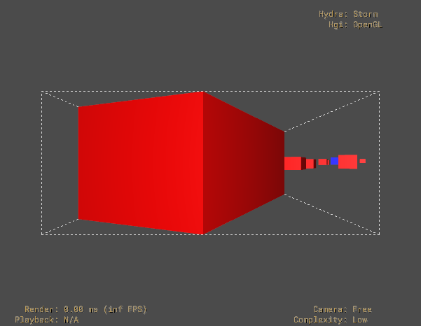

# Waymo Open Motion Dataset to OpenUSD

This project converted driving scenarios from the Waymo Open Motion Dataset into OpenUSD stages and ran a counterfactual safety analysis on them. A scan script read the `training_20s` TFRecord shards, scored every scenario by minimum distance and time-to-collision between the self-driving car and the other tracked objects, and kept five scenarios per typology as single protobuf files. A converter then wrote each selected scenario as one `.usd` file: every tracked object became an `Xform` prim with a `Cube` child scaled to its bounding box, positions and headings were written as time samples at 10 frames per second, per-frame velocities and Waymo metadata were stored as `waymo:` attributes, and the prim was hidden on frames where the track had no valid observation. The remaining scripts read those files back to compute distances and time-to-collision per frame, deactivate agents through USD sublayers to test whether a near miss disappears, and write the results as JSON. The attribute layout is documented in [AVXUSD_SCHEMA.md](AVXUSD_SCHEMA.md).



<!-- Screenshot slot: replace the image above with your own usdview capture if wanted. -->

## Requirements

- Python 3.10 on Linux or WSL. The `waymo-open-dataset` package publishes Linux wheels only; the pipeline was run under WSL Ubuntu.
- The packages in [requirements.txt](requirements.txt). Only the scan and convert steps need TensorFlow and `waymo-open-dataset`; every other script needs just `usd-core` and `numpy`.
- `usdview` or another USD viewer to look at the output. It is not part of `usd-core`; NVIDIA's prebuilt OpenUSD binaries include it.

```bash
python -m venv venv && source venv/bin/activate
pip install -r requirements.txt
```

## Getting the data

The dataset is not included and must not be committed to this repository. Download it from https://waymo.com/open/download/ after signing in and accepting the Waymo Dataset License Agreement for Non-Commercial Use. The terms at https://waymo.com/open/terms/ restrict use to non-commercial purposes such as research and teaching, allow sharing only with people who have registered and accepted the same terms, and ask that derived work state that it was made using the Waymo Open Dataset provided by Waymo LLC under that agreement.

This project used the Motion Dataset scenario protocol buffers from the `training_20s` split. Place the shards in `data/raw_tfrecords/` so that the files match `training_20s.tfrecord-*-of-*`. The scan script skips shards it cannot read, so a partial download works.

## How to run

All commands are run from the repository root.

1. Scan the shards, write `scenarios.csv`, and extract the selected scenarios as `.pb` files.

```bash
python src/select_safety_critical_scenarios.py --tfrecord-dir data/raw_tfrecords --csv scenarios.csv --extracted-dir data/extracted_scenarios
```

2. Convert the selected scenarios to USD. Output files are named `<scenario_id>_base.usd`.

```bash
python src/waymo_to_usd.py --extracted data/extracted_scenarios --csv scenarios.csv --out_dir scenarios
```

3. Check one file against the schema and run the frame-by-frame collision check.

```bash
python src/validate_schema.py scenarios/<scenario_id>_base.usd
```

```bash
python src/collision_check.py scenarios/<scenario_id>_base.usd
```

4. Find the agent whose removal resolves the near miss, and optionally compare ranking strategies.

```bash
python src/diagnosis_engine.py --base scenarios/<scenario_id>_base.usd --strategy semantic -v
```

```bash
python src/diagnosis_engine.py --base scenarios/<scenario_id>_base.usd --compare
```

5. Run the full evaluation over every scenario listed in `scenarios.csv`, then the risk-tier, ego-intervention, and report scripts. Each writes into `evaluation_output/` or `thesis_results/` by default.

```bash
python src/evaluation.py --all
```

```bash
python src/graduated_risk_framework.py --analyze
```

```bash
python src/minimal_intervention.py --batch
```

```bash
python src/generate_report.py --output thesis_results/
```

6. Open a result in usdview.

```bash
usdview scenarios/<scenario_id>_base.usd
```

The five synthetic scenarios under `scenarios/synthetic_scenarios/` were built in NVIDIA Omniverse, not from Waymo data, and are included. `convert_synthetic_to_avxusd.py --batch` rewrites the `*_baked.usd` files into the same layout as the Waymo output.

## What it does not do

- It does not export the map. Lanes, road edges, crosswalks, stop signs, and traffic lights from the scenario are read only to classify typology during the scan; nothing from the map is written to USD.
- It does not distinguish object types by geometry. Vehicles, pedestrians, and cyclists are all unit cubes scaled to their bounding box, telling them apart only through the `waymo:objectType` attributes and colour (blue for the ego vehicle, red for everything else).
- It does not fill gaps in a track. Frames without a valid observation get no transform sample; the prim is made invisible there instead. The analysis code does not read visibility. It uses `waymo:firstValidFrame` and `waymo:lastValidFrame`: the per-agent distance and TTC scan covers the agent's own span, and the box-overlap checks in `run_validation` and `diagnosis_engine.check_baseline` cover the intersection of the ego span and the agent span. Frames inside a span where the track briefly drops out are still evaluated at the interpolated position.
- It does not write `customData["scenario"]` or the `metrics:` attributes into the converted files by default. `waymo_to_usd.py` only defines the functions for that; the analysis scripts keep their results in JSON and in temporary intervention layers.
- It does not include any Waymo data, converted Waymo scenarios, or the CSV derived from them. These paths are in `.gitignore`.

## Layout

```
src/
  select_safety_critical_scenarios.py   scan TFRecords, pick scenarios, extract .pb files
  waymo_to_usd.py                       convert .pb scenarios to USD
  convert_synthetic_to_avxusd.py        rewrite Omniverse-baked USD into the same layout
  validate_schema.py                    check a USD file against AVXUSD_SCHEMA.md
  validate_pipeline.py                  compare a USD file with the scan metrics in scenarios.csv
  collision_check.py                    per-frame OBB distance, TTC, collision validation
  intervention_layer.py                 sublayers that deactivate agents
  diagnosis_engine.py                   ranked single-agent and pair removal search
  graduated_risk_framework.py           proximity-based risk tiers
  minimal_intervention.py               ego braking and speed-scaling counterfactuals
  evaluation.py                         oracle computation and strategy metrics
  generate_report.py                    Markdown, JSON, and CSV report
  export_visualization_data.py          chart data and LaTeX tables
  test_avxusd_implementation.py         integration tests
scenarios/synthetic_scenarios/          Omniverse-built synthetic scenarios (included)
docs/                                   usdview screenshots
AVXUSD_SCHEMA.md                        attribute and customData layout
```

## License

The code is released under the MIT License, see [LICENSE](LICENSE). The Waymo Open Dataset is licensed separately by Waymo LLC under the Waymo Dataset License Agreement for Non-Commercial Use and is not part of this repository.
